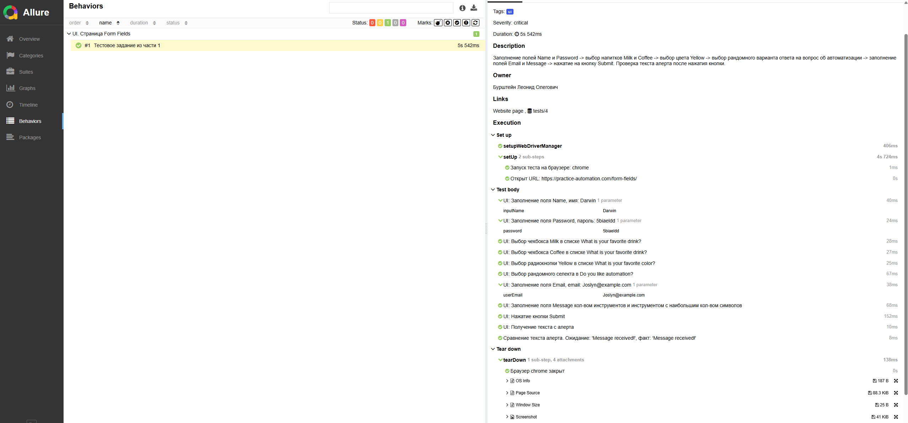
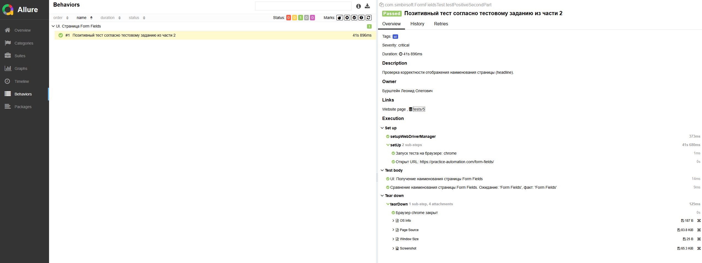
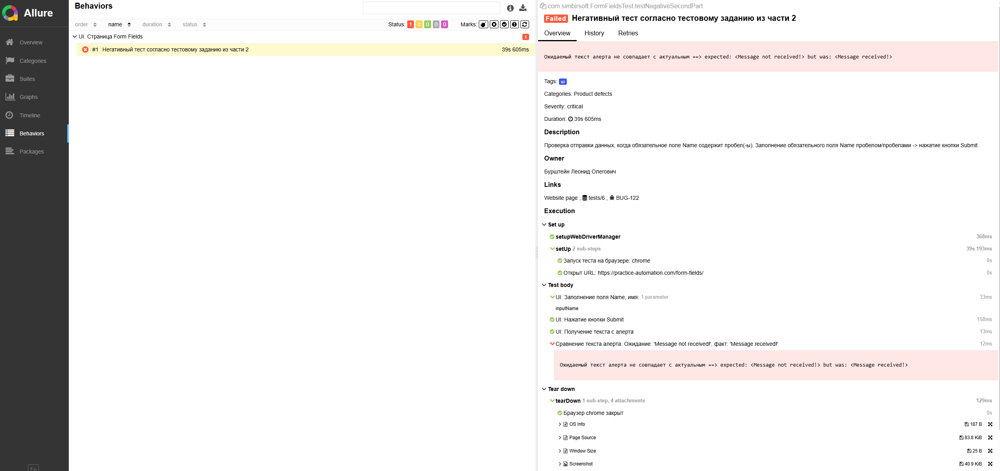

# Проект по автоматизированному тестированию

Этот проект создан в рамках тестового задания от IT-компании SimbirSoft для SDET-практикума
и демонстрирует автоматизацию веб-тестирования.

## Технический стек

- **Java 17** — основной язык разработки тестов.
- **Gradle 8.13** — система сборки и управления зависимостями.
- **JUnit 5** — фреймворк для написания и запуска тестов.
- **Selenium** — для взаимодействия с веб-приложением и автоматизации действий пользователя.
- **WebDriverManager** — упрощает управление драйверами браузеров.
- **Allure** — генерация наглядных отчетов о выполнении тестов.
- **AspectJ Weaver** — инструмент для внедрения аспектов.
- **JavaFaker** — генерация тестовых данных (имена, email и др.).
- **SLF4J Simple** — простой логгер для вывода информации о тестах.
- **Owner** — конфигурация для properties-файлов.

## Структура проекта

<pre>
test_task_sdet/
├─ .gradle/
├─ build/
├─ gradle/
├─ png/
├─ src/
│  ├─ main/
│  │  ├─ java/
│  │  │  └─ com/simbirsoft/
│  │  │     ├─ constant/
│  │  │     ├─ data/
│  │  │     ├─ framework/
│  │  │     │  ├─ config/
│  │  │     │  ├─ driver/
│  │  │     │  └─ util/
│  │  │     └─ page/
│  │  └─ resources/
│  │     └─ config.properties
│  └─ test/
│     ├─ java/
│     │  └─ com/simbirsoft/
│     └─ resources/
│        ├─ allure.properties
│        └─ junit-platform.properties
├─ .gitignore
├─ build.gradle.kts
├─ gradlew
├─ gradlew.bat
├─ README.MD
└─ settings.gradle.kts
</pre>

# Руководство по началу работы с проектом

### I. Создай директорию для проекта и перейди в неё
### II. Склонируй проект в созданную директорию с GitHub:
<pre><code>
git clone git@github.com:LeonidStein/simbirSoftSDET.git
</code></pre>
### III. Собери проект и запусти тесты (Тесты запускаются на Google Chrome):
<pre><code>
./gradlew build
</code></pre>
### IV. Просмотр Allure отчёта:
<pre><code>
./gradlew allureServe
</code></pre>

# Тестовое задание
### Часть 1
- **Наименование тестового метода** — testFormAndFieldsFirstPart, отчёт Allure:

### Часть 2
- **Наименование позитивного тестового метода** — testPositiveSecondPart, отчёт Allure:

- **Наименование негативного тестового метода** — testNegativeSecondPart, отчёт Allure:
- **Примечание: Исходя из ТЗ был придуман кейс с негативным сценарием, т.к., данная страница не продумана для них:**
    При заполнении обязательного поля Name пробелом или пробелами и после нажатии кнопки Submit
    должен всплывать аллерт с сообщением: "Message not received!", но этого не происходит, **поэтому данный тест должен упасть.**

